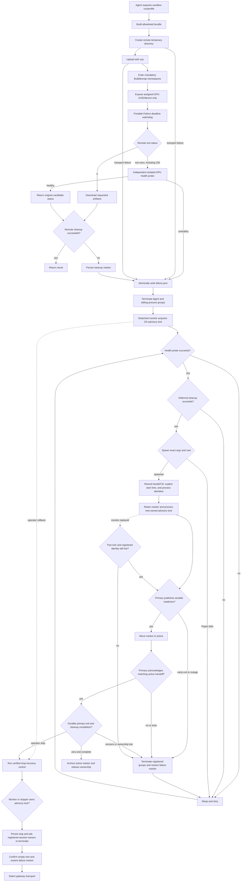

# Architecture Design

## Overview

Atrex Kernel Agent is an orchestrated system for GPU kernel implementation, profiling, and
iterative optimization. The repository has one supported entry point: `orchestrator/optimize.py`.
It owns the optimization lifecycle and launches isolated Long Horizon episodes through Claude,
Qoder, Codex, or Pi. A user may invoke that entry point directly or ask a coding agent in the
repository to translate a natural-language task into its CLI arguments and launch it.

Agent sessions propose and implement changes. The orchestrator remains authoritative for
budgets, state transitions, sandbox execution, correctness and performance gates, production
policy, rollback, aggregation, and final packaging.

Each canonical optimization version is one multi-experiment episode in a private Git worktree.
The internal `long_horizon/` engine supplies worktree isolation, journals, handoff recovery,
fast five-trial evaluator-backed selection or full same-allocation ABBA verification, and squash
promotion; it is not a second CLI.


## Design Goals

- **Mechanical control**: termination and acceptance are decided by code rather than Agent
  self-assessment.
- **Tiered optimization**: early fast episodes run five reviewed plan/implement/evaluator trials
  without profiling or ABBA; later full episodes are supported by official profiler evidence.
- **Reproducible state**: Git HEAD is the incumbent kernel; structured memory and artifacts
  preserve the reasoning and measurements behind each attempt.
- **Execution isolation**: GPU work crosses `tools/sandbox.py`; campaign memory, plans, edits,
  and Git state remain local.
- **Evaluator integrity**: immutable ground truth and full-workload validation prevent harness
  edits or partial-shape wins from becoming accepted results.
- **Production provenance**: production mode keeps deterministic structure and campaign-state
  invariants, while the supervisor sends every candidate to an isolated policy Agent for complete
  framework, compute-provenance, dependency, loader, and manifest review.
- **Backend portability**: one Agent Runtime interface normalizes commands, events, usage, and
  process policy across supported coding CLIs.

## Project Structure

```text
.
├── orchestrator/
│   ├── optimize.py                    # CLI entry point: arguments, framework dispatch, run wiring
│   ├── campaign.py                    # Single-operator campaign: baseline, episodes, promotion
│   ├── operator_layout.py             # Supported operator layout detection
│   ├── session_io.py                  # Coding-agent sessions, dependency review, sandbox I/O
│   ├── workspace_state.py             # Canonical memory, git facts, stall counter
│   ├── workspace_runtime.py           # Workspace runtime links, agent skills, directives
│   ├── hardware.py                    # Vendor/framework identity and Gluon escalation
│   ├── constants.py                   # Shared paths, policy defaults, state filenames
│   ├── agent_runtime/                 # Claude/Qoder/Codex/Pi adapters and process policy
│   ├── telemetry/                     # Phase timing and token telemetry
│   ├── optimization_policy.py         # leaderboard/production policy gates
│   ├── precision_gate.py              # GPU allocation, sessions and evidence digest for the precision gate
│   └── prompts/                       # Setup, inspection, baseline, and episode prompts
├── long_horizon/                      # Episode worktrees, handoff protocol, ABBA verification
├── agents/                            # Baseline Agent definition injected into campaign workspaces
├── skills/                            # Backend-local workflows, including adaptive PPU profiling
├── tools/
│   ├── sandbox.py                     # Remote packaging and execution boundary
│   ├── memory_manager.py              # Structured iteration memory manager
│   └── profile_*.sh / analysis tools  # NVIDIA and AMD profiling helpers
├── reference/                         # Workspace init, evaluator adapters, schema, SOL packaging
├── gpu-wiki/                          # Structured hardware/kernel retrieval and trace mining
├── plugins/                           # Automatically discovered local plugin manifests and adapters
│   ├── gpu-wiki/                      # Scoped GPU optimization experience and hardware facts
│   └── precision-validation/          # Precision policy: suite, schedule, GPU driver, evidence checks
├── reference-projects/                # Optional source-search repositories
└── 3rdparty/                          # Profiler-analysis dependencies and the vendored evaluator
    ├── ncu-report-skill/              # NCU report analysis skill
    └── atrex-bench/                   # Official Atrex-Bench evaluator and comparator
```

The `skills/` and `agents/` directories are internal runtime assets. The orchestrator links or
installs them into generated campaign workspaces; they are not standalone repository entry
points.

### Authority boundaries

| Boundary | Owner | Durable result |
| --- | --- | --- |
| Campaign control | `orchestrator/campaign.py` | Workspace Git history and canonical memory |
| Episode exploration | `long_horizon/` plus one coding-agent session | Journal, handoff, archived attempt and telemetry |
| GPU execution | `tools/sandbox.py` plus the configured executor | Structured evaluator result and requested profile artifacts |
| Optimization knowledge | Discovered plugins, then optional `reference-projects/` | Evidence references recorded by the episode |

The Agent may edit only its isolated candidate worktree. It cannot decide promotion, mutate the
incumbent directly, replace evaluator inputs, or use local host GPU execution. Conversely, the
supervisor does not generate optimization code: it validates, measures, records, and promotes
exact committed sources.

## Supported Entry Point

For interactive use, the recommended surface is a repository-scoped coding-agent prompt:

```text
Use AKA's orchestrator/optimize.py to start one optimization task for atrex-bench/xx. Put the workspace under ~/aka-opt, set the platform to H20, use the local sandbox, use claude as the Agent CLI, set max-iters to 300, specify cuda as the framework, and run in production mode.
```

The coding agent resolves the request, checks prerequisites, and invokes the same supported entry
point. It does not own campaign state transitions, acceptance, or termination, and this launch
surface does not create a second optimization workflow.

For automation and direct operation, invoke the entry point explicitly:

```bash
python orchestrator/optimize.py \
  --op-dir /path/to/operator \
  --platform TARGET_GPU \
  --sandbox-hardware REMOTE_GPU \
  --framework Triton
```

Both launch surfaces converge before campaign initialization. The orchestrator creates an isolated
Git-worktree episode for each optimization version. A fresh Agent thread may perform several related
profile/research/edit/validate cycles. Claude and Codex
support bounded same-thread recovery when the terminal handoff is incomplete; canonical state
crosses episode boundaries through Git, structured memory, journals, plans, and profiles.

The main workspace name is deterministic. Leaderboard mode uses
`kernel_opt_<op>_<framework>_<platform>`; production mode appends `_production` so a strict
production campaign cannot silently resume permissive leaderboard history. Omitting `--framework`
launches one child process and one independent workspace for every framework supported by the
runtime-detected GPU vendor.

## Core Components

### Campaign lifecycle

`Campaign` in `orchestrator/campaign.py` is the single-operator state machine:

1. Materialize or resume a Git workspace and validate its committed V0.
2. In production mode by default, create and pin a self-contained framework-native V1.
3. Create one private branch/worktree per canonical version. The first two optimization episodes use
   five fast `plan -> implement -> evaluator` trials per episode by default; later episodes use the
   full evidence loop. The primary Agent uses maximum reasoning effort in both modes.
4. Validate its structured journal and `candidate_ready`, `pivot`, or `blocked` handoff, with
   bounded same-thread recovery for Claude and Codex.
5. Check protected paths, the exact committed `kernel.py`, and production policy while allowing
   uncommitted intermediate artifacts to remain in the episode worktree.
6. Select the fastest passing hash-matched result from each fast episode's five trials and compare it
   with canonical incumbent memory; compare full-mode candidates in one independent ABBA allocation.
7. Squash-promote only a strict correctness-passing improvement; otherwise commit only canonical
   failure/pivot/block evidence.
8. Stop on version budget, token budget, optional stall budget, or target utilization.
9. Recheck production policy and package the final candidate.

`HEAD` is always the incumbent. A failed, regressing, or policy-violating candidate is not
allowed to replace it.

### Agent Runtime

`orchestrator/agent_runtime/` separates backend-specific command and event formats from campaign
control. Adapters expose a common request/result model containing:

- exit status and timeout state;
- normalized session identity;
- terminal token usage;
- per-event usage deltas and phase-marker receipts when supported;
- backend capability and observation-error metadata.

The process supervisor also protects the host execution boundary by rejecting dependency builds,
direct host GPU execution, and profiler use outside the sandbox.

### Workspace runtime assets

`link_runtime()` exposes `tools/`, `reference/`, `skills/`, `reference-projects/`, and discovered
plugin resources inside each campaign workspace. AKA discovers each `plugins/*/plugin.json`; the
bundled GPU Wiki plugin provides `gpu-wiki.query` through `tools/plugin.py`. Plugin manifests own resources and phase instructions; campaign locks
check versions and content fingerprints on resume. See [Local plugins](plugins.md).
It also prepares backend-specific project-local discovery trees:

- `.claude/` and `.qoder/` receive Agent definitions and knowledge skills;
- `.agents/skills/` receives repository-scoped Codex/Pi optimization skills;
- The repository-native `gen-plan` skill is linked into every backend's local discovery tree. It
  freezes a concrete candidate proposal and independently obtains the Codex and Qoder reviews enabled
  for the current episode mode against that proposal and the same bounded evidence. A matching primary
  backend reviews in its current session to avoid recursion. The campaign probes each reviewer when it
  is first enabled, caches the result in private runtime state, and disables later calls to reviewers
  that were unavailable.

### Sandbox execution

All correctness, benchmark, and profiling work crosses
`tools/sandbox.py`. The sandbox builds an explicit input allowlist, omits optimizer-only state,
submits evaluator or profiler work to the configured remote executor, and synchronizes only the
requested result artifacts. Campaign memory, plans, edits, episode state, and Git history stay on
the coordinator.

The remote executor is selected explicitly. Gateway URL/profile modes retain typed evaluator and
profiler requests plus their existing HTTP/OSS transports. OpenSSH mode creates a fresh
`/tmp/atrex-sandbox.*` directory and uploads the allowlisted bundle with `scp`, but never executes a
candidate in the login account's ordinary shell. `tools/sandbox.py` always enters a Bubblewrap
namespace that exposes a minimal read-only system tree, explicitly configured read-only runtime
directories, one assigned physical NVIDIA GPU, and the one writable job directory. Runtime bind
sources are denied when broad/sensitive, resolved on the remote host, and validated again so a
symlink cannot restore access to credentials or a host root. The physical index is resolved to a GPU
UUID; its device node and common driver nodes are the only GPU devices bound. MIG mode fails closed
until capability-node assignment is available. The namespace unshares network, PID, IPC, and
UTS namespaces, replaces `HOME` and `/tmp`, and clears the inherited environment. The remote Python
watchdog enforces the requested command deadline without relying on GNU `timeout`.

SSH aliases, keys, ports, and jump hosts are resolved by standard OpenSSH configuration. Bubblewrap
and unprivileged user namespaces are mandatory; there is no unisolated fallback. These modes are
mutually exclusive, and neither makes remote filesystem state authoritative.

### Environment failure recovery

SSH command failures, including status 255, pass through an independent isolated GPU health probe.
The default probe performs allocation, arithmetic, and synchronization. SSH campaigns persist an
additional trusted framework/SOL runtime preflight and run it before initialization, even with an
explicit architecture. Recovery polling replays both probes, so an incompatible evaluator does not
repeatedly restart the optimizer merely because CUDA device properties are readable. Native bundled
evaluator contracts and candidate correctness remain the real evaluator's responsibility.
A healthy probe preserves the original exit status as a candidate/tool failure. A transfer exception,
or a failed probe after a failed command, atomically transitions the optimizer to
`environment_blocked` and records a private marker. The coding-session process guard watches that
marker and terminates the complete Agent process group. Supervisor-owned sandbox processes poll the
same marker, terminate their own process groups, and cancel queued ABBA futures; SSH ABBA batches run
serially on the assigned GPU, and SSH auto-framework dispatch is rejected. A remote directory that
could not be deleted is recorded separately and becomes a
required recovery action rather than being forgotten.

Only the outer recovery owner starts `tools/monitor_optimize_tasks.py`. The detached monitor holds an
OS advisory lock, repeats the configured health probe, removes every deferred remote workspace, and
then replays the exact original argument array and working directory. Recovery state is keyed by the
resolved target, init, runtime binds, assigned GPU, health probe, and a unique invocation identity;
existing metadata is validated before reuse. After `Popen`, the monitor retains the marker as
`restarting.json` while it supervises operator resolution, architecture/submodule setup, campaign
construction, and workspace resume. An early exit restores `failure.json`; the durable campaign
resume signal begins a two-phase transition: the monitor moves the marker to `active.json`, then the
same registered primary must observe that marker and persist an acknowledgement. The monitor remains
alive until the recovered optimizer exits. The marker records a fresh handoff ID and explicit start
time, so the initialization timeout is independent of the older outage marker mtime. A second advisory
lock is inherited by the restart process tree. The root and each controlled independent session start
behind a stable wrapper, gated primary, and cleanup guardian in a separate session. All three
kernel-start-time-qualified identities are written to the handoff registry before the actual command
can run. The wrapper persists the primary result immediately, cleans same-group descendants, and only
then persists completion. If the wrapper dies after recording the result, the guardian retains the
lock, cleans the target group, and commits the same completion record. Every protocol write fsyncs its
temporary file before replacement, and every critical replace or unlink fsyncs the affected directory.
A replacement monitor can therefore adopt a live interrupted handoff and distinguish proven cleanup
from an ownerless interruption without signalling a reused raw diagnostic PID or depending on periodic
descendant snapshots. Resolved
environment-only recovery options are replayed, and `monitor.pid` is removed by its matching lock
owner on exit. Existing V1 snapshots and Long Horizon active episode state provide the restart
boundary. User
interrupts, budget termination, and failures followed by a healthy probe never create a monitor.

An interrupted SOL V0 with committed sources reuses that source commit and retries measurement;
changed, missing, or staged sources fail closed without being overwritten. Long Horizon usage is
durably recorded after each coding invocation, before propagating an environment failure and before
GPU verification. Cumulative per-run receipts and token totals share one atomic state replacement:
replaying a receipt does not double count, and recovery retains actual token usage without consuming
an episode outcome. Partial reported usage is counted; unavailable usage is not fabricated.



The motivating failure mode is an unattended optimization losing a GPU host after hours of work:
previously it either consumed candidate budget for an infrastructure fault or required a human to
reconstruct the exact launch. Success means candidate failures retain their status, confirmed
environment failures stop all active work, no uploaded workspace survives recovery, only one monitor
runs, and the exact command resumes automatically. The tradeoffs are an additional SSH/upload and
namespace startup cost, a Bubblewrap requirement, no network inside candidate jobs, and explicit
read-only binds for runtimes outside the minimal system tree.

Rollback is configuration-only: run `.atrex_environment/<command-id>/stop-recovery.sh` and require
its verified zero status, archive that private directory for diagnosis, and relaunch the same command
with `--sandbox-url` or `--sandbox-profile` instead of `--sandbox-ssh`. Each stop first writes an
immutable request that is handled by the live monitor, or by the stopper after it acquires the monitor
lock; it succeeds only after the identity-owned process tree is empty and `stopped.json` is committed
under that lock. Resume clears only its locked request snapshot, so a later stop cannot be erased. The
persistent tombstone also blocks a detached monitor that had not reached the lock when stop was
requested.
`monitor.pid` is diagnostic and must not be signalled as a rollback mechanism. No candidate Git
commit or canonical memory needs to be reverted. Run the generated `recover.sh` (or pass `--resume`
while starting the monitor) to clear the tombstone under the monitor lock. If automatic restart is
undesired but SSH should remain enabled, use the same verified stop path and then run
`python tools/monitor_optimize_tasks.py --state-dir STATE_DIR --resume --once --no-restart` after
cleaning any listed remote workspaces.

### Full-workload optimization

SOL and native Atrex-Bench operators run one campaign over the complete workload set. Every
candidate is validated for full-workload correctness and compared by its full-workload geomean.
Production makes generalized input handling a mode policy rather than an operator opt-in. A native
operator's user-provided `agent_problem.json` is validated and used directly. When only detailed
`shapes.json` exists, a dedicated clean problem-authoring session reads the evaluator inputs in an
ephemeral directory and derives the public contract before any baseline or optimization session runs.
Only the resulting generalized domain, invariants, safe aggregate distribution, and synthetic
development cases enter the campaign workspace.

The sandbox injects exact shapes and evaluator metadata only at the official remote evaluation
boundary. Profiling selects an opaque id from canonical memory and injects only that real shape into
the ephemeral remote profile job; the complete hidden shape table never enters the workspace.
Optimization feedback retains aggregate results plus real per-shape latency keyed by opaque shape id,
while withholding shape inputs, per-case failure details, and raw evaluator logs. The Atrex-Bench
runtime is copied into the workspace without linking its checkout-level `data/` tree. Sandbox private
shape injection, opaque-shape profiling, and generalized result masking require the persisted workspace
mode to be `production`. Leaderboard always retains legacy exact-shape exposure, regardless of whether
the source operator also contains a public problem contract.

### Production policy

`optimization_mode=leaderboard` allows evidence-backed framework changes and compatible
third-party libraries. `optimization_mode=production` is fail-closed:

- the selected framework is a hard constraint;
- every candidate is reviewed by an independent Agent according to actual use, without import
  allowlists or package-name rejection; toolchain/launch plumbing may be accepted, while prebuilt
  compute, alternate frameworks, PyTorch compute fallbacks, hidden dispatch, and external code are
  rejected;
- deterministic checks retain only syntax, self-containment, single-file versioning, immutable
  campaign state, and the Triton-to-Gluon phase latch;
- `kernel.py` and `solution.json` are copied into a bounded temporary workspace for every complete
  production-candidate review;
- a missing, malformed, incomplete, or evidence-mutating Agent verdict fails closed;
- violating episode candidates are rejected before promotion and recorded as failed memory.

#### Precision gate

Production promotion runs a second, independent gate after the framework/dependency review passes.
Its policy is a plugin, not main-line code: `plugins/precision-validation/` owns the numerical suite
schema, the probe schedule, the input constructors, the GPU-side driver, and the checks that decide
whether returned evidence and an independent review discharge the plan. It exposes three pure tools —
`plan`, `check-evaluation`, `check-review` — and the supervisor drives them itself, because this is an
acceptance gate on the agent's own output. The plugin contract has no private-tool concept, so those
three ids are still advertised to the agent like any other; that is harmless because all three are
pure functions of their arguments and the supervisor only ever acts on results it obtained by calling
them with its own trusted inputs. An agent calling them learns nothing it could not read in the
repository and cannot influence the verdict. Before each gate run the supervisor re-fingerprints the
plugin tree and re-checks it against the workspace lock, so editing the policy on disk mid-campaign
blocks promotion instead of relaxing it.

`orchestrator/precision_gate.py` keeps only what a plugin tool cannot: the GPU allocation and its
queue wait (a tool's timeout caps at 3600 seconds, below a gateway admission wait), the isolated
suite-author and reviewer sessions, and the evidence digest that binds a pass to the exact candidate,
trusted contract, driver and prompt bytes. A non-empty violation list blocks promotion; any blocked
or malformed gate result also blocks it, so a broken gate can never read as a pass.

The comparison itself belongs to Atrex-Bench, vendored as `3rdparty/atrex-bench`. The gate
regenerates every operator input from declared construction families and then asks Atrex-Bench
whether the candidate still matches the reference under the operator's own tolerances — additional
seeds of the ordinary generator are explicitly not evidence. Probes run under Atrex-Bench's
`untrusted` guard profile, downgraded to `trusted` for `Cuda` campaigns, which compile through the
runtime extension loading that profile blocks.

Independently of optimization mode, Triton campaigns enter a mandatory Triton-to-Gluon episode after
the configured stall threshold. The episode receives an explicit conversion directive and
TTGIR/conversion-sheet workflow. Conversion remains latched until a committed Gluon candidate passes
correctness and performance-parity gates.

### Long Horizon episode engine

`Campaign.run()` in `orchestrator/campaign.py` invokes the internal Long Horizon engine. It creates
an isolated branch and Git worktree from the incumbent for each episode. The Agent records
structured experiments in a journal and publishes one terminal handoff: `candidate_ready`,
`pivot`, or `blocked`.

A candidate must commit a `kernel.py` that still matches the worktree, preserve protected paths, and
satisfy production policy. Other uncommitted intermediate artifacts may remain in the worktree.
Fast candidates must have one complete passing evaluator record whose `kernel.py` hash matches the
final candidate and whose latency strictly improves on canonical incumbent memory. Full candidates
must pass the exact same-allocation ABBA schedule. Accepted candidates are squash-promoted with
canonical memory; rejected and non-candidate episodes advance memory without changing the incumbent.
Every round's numbered memory is checked against committed `HEAD` before state advances. Active
episode state supports crash recovery.

## End-to-End Flow

### 1. Resolve the operator and runtime

`--op-dir` supplies all operator-specific ground truth. The orchestrator detects SOL or native
Atrex-Bench format, probes the runtime GPU architecture, resolves the framework set, initializes
required submodules, and creates a framework/hardware-suffixed workspace below `--workspace` or
the current directory.

### 2. Establish V0

SOL and native Atrex-Bench operators receive a mechanically seeded PyTorch reference wrapper and
immutable evaluator inputs. The supervisor writes the README, commits the source baseline, runs one
official full-workload base-seed evaluator, writes `memory/v0.json` plus a concise report, and commits
that measurement separately. Memory points to the stable source commit, so no commit-hash amend loop
is possible. Only the non-canonical derived legacy boundary retains a bounded setup Agent fallback.
V0 profiling, multi-seed validation, and ABBA are intentionally deferred.

### 3. Establish the framework baseline

Production mode runs a dedicated framework-baseline session by default
(`--framework-baseline=auto`). For a supervisor-seeded reference V0 it skips the redundant pre-V1
policy review and pre-creates a minimal native `solution.json`. Before the implementation Agent starts,
the supervisor gives the bounded public contract, immutable reference, input builder, and V0 evidence to
the enabled isolated Codex and Qoder reviewers, in parallel when both are enabled. Their
correctness-only reviews are cached under
`.atrex_long_horizon/framework_baseline/`, reconciled in the V1 prompt, and never receive private shapes or
permission to edit the candidate. Each reviewer may nominate at most two paths from a mechanically bounded
local reference catalog. The supervisor prefers reviewer consensus, publishes no more than two exact paths,
and prevents V1 from recursively browsing sibling references. The coding Agent then implements one
correctness-first framework candidate and iterates only on three native smoke ids chosen across the V0 latency
distribution. It does not run the full workload, multi-seed, benchmark, memory writer, or Git commit.
After the Agent exits, the supervisor runs the complete policy review concurrently with one combined
evaluator call that measures base-seed performance and checks five additional correctness cases. It writes
canonical memory, commits V1, and pins that commit for optimization. `always` enables this stage in
leaderboard mode; `never` starts from V0.

V1 uses exit-triggered recovery rather than continuous journaling. A non-zero Agent exit, timeout,
or runtime exception causes one local snapshot of the candidate, debug artifacts, Git state, and
terminal tails under `.atrex_long_horizon/framework_baseline/`. A separate read-only progress
supervisor summarizes them into `resume.json`; only that supervisor falls back through the configured
Agent CLI, Codex, then Qoder. The outer V1 implementation stays on `--agent-cli`. Process restart
preserves the interrupted worktree and restores the latest candidate snapshot when necessary.

### 4. Explore one episode per version

By default, optimization episodes 1 and 2 use the fast loop:

```text
repeat five times:
  reviewed plan -> implement -> one full-workload base-seed evaluator
select fastest passing hash-matched trial -> handoff
```

Fast mode uses the normal `gen-plan` synthesis with the reviewers enabled for fast episodes inside its
planning phase. Those reviewers default off. Fast mode does not run a separate research phase,
profile, run multi-seed correctness, or run ABBA. The
sandbox records the evaluator result with the final `kernel.py` hash. The supervisor uses that result
for correctness and compares it with the latest complete passing canonical incumbent measurement.
`--fast-episodes 0` disables this path; another non-negative value changes its window.

Episode 3 and later use the full evidence loop as many times as needed:

```text
profile -> research -> plan -> edit/compile/repair
        -> correctness -> benchmark -> journal/checkpoint -> repeat or handoff
```

GPU commands run remotely while plans, source edits, journals, and Git remain local. A
`candidate_ready` handoff is not authoritative: the supervisor validates protected paths, policy,
the worktree's exact committed `kernel.py`, and the candidate commit, then applies the current mode's
fast comparison or incumbent/candidate ABBA gate. A rejected candidate, `pivot`, or `blocked` outcome
advances canonical memory without changing the incumbent. Active episode state is restart-safe and
reuses the registered worktree with its intermediate files after a supervisor restart.

For progress visibility, the supervisor creates ignored `memory/live.json` at episode start and the
journal command refreshes it after every decisive experiment. This live view is explicitly
non-canonical; a numbered `memory/v<N>.json` is written after terminal handoff processing and
mode-appropriate verification, then checked for valid committed contents before state advances.

### 5. Finalize

At termination, production mode rechecks policy and SOL campaigns emit a directly submittable
output.

## Workspace State

```text
kernel_opt_<name>_<framework>_<platform>[_production]/
├── kernel.py
├── test_kernel.py
├── README.md
├── memory/v<N>.json
├── memory/long_horizon_e<NNNN>.json  # Evidence for promoted episodes
├── plans/
├── profiles/
├── framework_baseline.json
└── .atrex_long_horizon/               # Episode state, journals, telemetry, verification
```

Not every campaign uses every artifact. Git plus unmasked `memory/v<N>.json` files are the durable
optimization history. `.atrex_long_horizon/` and temporary verification payloads are excluded
from main-workspace commits; their recoverable local state remains on disk.

## Profiling and Telemetry

- NVIDIA profiling uses `tools/profile_nvidia.sh` and Nsight Compute.
- AMD profiling uses `tools/profile_kernel.sh`, rocprofv3, ATT, PMC, and assembly extraction.
- PPU profiling uses `skills/ppu-acu-joint-profile/` as an evidence router: ACU-only device analysis,
  standalone adaptive timeline analysis, and bounded joint analysis are separate selectable modes.
  PPU alone uses a per-iteration evidence gate: the episode agent may skip a new PPU profile when
  source or compiler inspection, the probe-free benchmark, or still-valid PPU evidence already
  answers the current question. Otherwise it chooses the least intrusive decisive route and stops
  when that route answers the question. Timeline writers and sites remain hypothesis-driven;
  optional joint analysis uses an independent probe-free ACU launch, and full-block lifetime
  coverage remains opt-in tail evidence.
- A PPU terminal journal may select still-valid ACU, timeline, joint, candidate-comparison, or
  measured-envelope conclusions as `accepted_ppu_diagnostics`. The supervisor recomputes the outer
  and transitive artifact hashes, then invokes the schema-specific validator; only decision-grade
  evidence with a matching authoritative kernel, binding payload, schema, evidence id, and accepted
  validation state is retained. Comparison identity and invalidation conditions remain explicit in
  the row. Canonical memory writes revalidate each row against the episode worktree on promoted,
  rejected, and interrupted paths. Invalid optional rows are excluded with a reason rather than
  aborting the campaign. JSON receipts are limited to 64 MiB; their hash and parsed metadata come
  from the same read, while raw artifact hashes are streamed. The supervisor then adds stable
  memory and artifact references to canonical `memory/v<N>.json`. A later episode can therefore
  decide whether to reuse the bounded conclusion without loading the raw episode archive.
- `tools/memory_manager.py` creates, reads, updates, masks, and summarizes iteration records.
- Episodes attribute wall time and token usage to profile, research, planning, implementation,
  correctness, benchmark, and recording phases when the backend emits complete markers and usage
  deltas.
- Missing or inconsistent observations are retained with explicit partial/unavailable measurement
  labels rather than fabricated values.

## Critical Constraints

- Hardware specifications require auditable sources from enabled knowledge tools or primary references.
- Official profiler evidence is required before full-mode optimization changes; fast mode explicitly
  substitutes five reviewed plans plus hash-matched evaluator results and best-candidate selection.
  PPU is the scoped exception: follow `ppu-acu-joint-profile` and collect new PPU profiler evidence
  only when its per-iteration decision rule says the unresolved fact can change the next edit.
- Ground-truth evaluator inputs are immutable.
- Correctness must pass before performance conclusions or promotion. In production mode a candidate
  must additionally clear the independent precision gate, which regenerates inputs from declared
  construction families rather than reseeding the operator's own generator.
- Generalized production operator directories must live outside this repository, so a workspace
  cannot reach their exact shapes through its repository symlinks.
- Every accepted candidate must be represented by Git and structured memory.
- `masked: true` memory is excluded from active planning.
- Production candidates must be self-contained in their selected framework.
