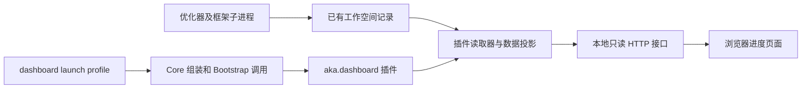

# 优化进展展示插件设计

新增可选的 `aka.dashboard` Core 插件，以独立的 `Startup` 启动一个本地只读页面，展示优化阶段、实验结果和 token 消耗。插件读取优化工作空间已有的结构化文件，一个页面可以观察同一目录下的多个框架 campaign。通过独立的 launch profile 启用，安装和运行优化器时无需加载 UI。

第一版已实现，采用 Python 标准库 HTTP 服务、原生 HTML/CSS/JavaScript 和两秒轮询，直接读取真实工作空间记录。运行配置、流式用量与全流程 receipt 仍属于后续扩展；当前 UI 明确展示已结算、待结算和不可用，缺失预算不生成百分比。

## 现有能力

当前 Core 可以组装独立插件，由 Bootstrap 调用 profile 指定的 `Startup.run(Invocation) -> int`，并在调用结束后释放组合。UI 可以使用这个入口，无需新建一套插件框架。[Core 接口](plugin-framework.md)和[启动方式](application-plugin-migration.md)规定了具体契约。

仓库还有用于 Agent 工具和 Skill 的 `plugins/*/plugin.json` 与 `plugin_runtime/`。展示服务采用 Core 插件；它的服务进程、HTTP 接口和静态资源由 Core 插件生命周期管理。

| 已有数据 | 可以展示的内容 | 当前边界 |
| --- | --- | --- |
| `memory/live.json` | 活动 episode、目标版本、实验数量、最近实验、最近更新时间 | 在 journal 写入后刷新；属于非 canonical 进度 |
| `.atrex_long_horizon/active_episode.json` | episode 模式、工作树、准备、探索、验证、晋升等阶段 | 进程终止后可能仍然保留，不能单独证明任务正在运行 |
| `.atrex_long_horizon/state.json` | episode 结果计数、已结算 tokens、去重 receipt | 主要在 Agent invocation 返回后结算；统计 episode 主 Agent |
| `.atrex_long_horizon/episodes/eNNNN/attempt.json` | 接受或拒绝、原因、验证结果、episode tokens | 终态归档；和 state、telemetry 存在重复信息 |
| `.atrex_long_horizon/episodes/eNNNN/telemetry.summary.json` | 输入、输出、缓存、阶段用量、观测质量、原因码 | 通常在 episode 结束后生成；可能为 partial 或 unavailable |
| `memory/v<N>.json` | canonical 版本性能、正确性、优化摘要 | 拒绝记录可能携带 incumbent 的性能，需要识别 measurement subject |
| `framework_baseline.json` 和 V1 crash progress | 已建立的框架基线、异常退出后的恢复信息 | V1 的 `progress.json` 是退出快照，不是持续更新的进度 |
| `trace-retention-manifest.json` | 最后一次终态记录、平台和硬件标识 | 旧终态文件可能保留到下一次运行结束，不能覆盖新的活动记录 |

上述目录均相对于单个 campaign 工作空间。读取器应兼容初始化阶段只有部分文件的情况。

## 插件结构



优化器负责控制、验证和晋升。展示插件负责读取、汇总和呈现；它不参与 token 预算执行、canonical memory 写入、环境恢复或候选接受判断。读取器不调用会创建目录或修改 Git excludes 的 `CampaignStore` 构造函数。

`atrex-aka-dashboard` 独立打包，通过匹配版本的 Bootstrap 依赖 Core 和 Contracts，不依赖优化器包。仓库源码位于 `src/aka/dashboard/`，打包配置位于 `packages/atrex-aka-dashboard/pyproject.toml`。包内包含以下文件：

```text
src/aka/dashboard/
├── __main__.py                # 源码启动器，仍通过 Bootstrap profile
├── plugin.py                  # Core 声明、构造和 cleanup 注册
├── startup.py                 # 同步 Startup 入口和观察目录参数
├── reader.py                  # 已有文件的只读投影与 schema 适配
├── server.py                  # 显式路由和本地 HTTP 服务
├── static/index.html          # 原生页面及样式、脚本
└── profiles/
    ├── dashboard.json         # Bootstrap launch manifest
    └── compositions/dashboard.json
```

`tools/build_distributions.py` 的 `OWNERS` 包含 dashboard 包归属，并为该包额外收集 HTML 静态资源。package data 包含静态页面及两层 profile JSON；构建器先生成 sdist，再从 sdist 构建 wheel。

插件模块声明 `name = "dashboard"`、`provide = ("startup",)` 和同步 `apply(ctx, config)`。`apply` 只构造对象、调用 `ctx.provide("startup", startup)` 并注册 `ctx.effect(startup.close)`。HTTP 绑定和目录扫描在 `Startup.run()` 被调用后开始，导入或 boot 不启动服务。`close()` 必须幂等，释放 socket 和请求线程；`run()` 的退出清理和 Core dispose 可以安全重复调用。

独立 dashboard profile 的目标为 `startup`，组合只装载 dashboard 插件。它与优化 profile 使用不同 Root；父进程、框架子进程和恢复进程不会重复绑定 UI 端口。第一版启动一个观察服务即可覆盖多个 campaign。

## 启用方式

Launch manifest `profiles/dashboard.json`：

```json
{
  "api_version": 1,
  "composition": "dashboard",
  "target": "startup"
}
```

Sibling composition `profiles/compositions/dashboard.json`：

```json
{
  "api_version": 1,
  "patches": [
    {
      "id": "dashboard",
      "insert": {
        "name": "aka.dashboard.plugin",
        "required": true,
        "config": {
          "host": "127.0.0.1",
          "port": 8765,
          "refresh_ms": 2000
        }
      }
    }
  ]
}
```

`Config` 只允许 `127.0.0.1` 监听，校验 0 至 65535 的端口及正整数刷新间隔。`port=0` 由系统分配空闲端口；指定端口占用时报告明确错误。静态资源纳入包数据和插件 `identity_files`，保持 Bootstrap 对实现及资源的身份验证。第一版沿用 strict resume policy。

源码目录中无需安装包即可启动：

```bash
PYTHONPATH=src python -m aka.dashboard --workspace /path/to/runs
# 让系统选择空闲端口：
PYTHONPATH=src python -m aka.dashboard --workspace /path/to/runs --port 0
```

页面使用英文界面。只预览有任务时的展示，可运行 `PYTHONPATH=src python -m aka.dashboard --demo --port 0`。演示包含探索中的 CUDA campaign、已接受与拒绝的轮次、阶段 token 分布以及用量不可用的 Triton campaign。页面显式标记 “Demo mode · Sample campaign data”；演示使用临时工作空间，不启动 Agent 或 GPU 作业，服务退出后删除示例数据。`--demo` 与 `--workspace` 互斥。

安装包的使用方式：

```bash
# 启动优化，继续使用现有 application profile。
aka optimize --repo-root /path/to/aka -- \
  --op-dir /path/to/problem --platform H20 --framework Cuda \
  --workspace /path/to/runs

# 另一个终端启动展示插件。profile 的绝对路径来自安装包或源码目录。
aka run --profile /path/to/aka/src/aka/dashboard/profiles/dashboard.json -- \
  --workspace /path/to/runs
```

可用 `python -c 'from pathlib import Path; import aka.dashboard; print(Path(aka.dashboard.__file__).parent / "profiles/dashboard.json")'` 获取已安装 profile 的路径。`--port` 参数放在 `--` 后，覆盖当前展示服务的监听端口。修改默认刷新间隔可使用 Core 的 `--patch`，配置替换时保留所需的 host、port 和 refresh_ms。

构建和安装 UI 及其依赖：

```bash
python -m pip install build
python tools/build_distributions.py --output /tmp/aka-dashboard-dist \
  atrex-aka-core atrex-aka-contracts atrex-aka-bootstrap atrex-aka-dashboard
python -m pip install /tmp/aka-dashboard-dist/*.whl
```

`--workspace` 接受单个 campaign，或包含 `kernel_opt_*` 的父目录。父目录只扫描直接子目录，不递归扫描 episode 私有工作树。安装包用户应使用包内 profile 的实际绝对路径；沿用现有 `aka run --profile`，第一版无需贡献新的 CLI 命令。

服务启动时打印实际浏览器地址，按 Ctrl+C 结束展示服务。优化结束后页面仍可查看历史记录。

## 页面内容

页面保持单屏主视图，桌面端把趋势和 token 明细并排，窄屏顺序排列。框架或 campaign 选择器只在有多个任务时出现。

| 区域 | 展示内容 | 交互 |
| --- | --- | --- |
| 任务头部 | 算子、框架、平台、最近一次观测阶段、数据更新时间 | 切换 campaign |
| 当前活动 | 当前 episode 和版本、fast/full/goal、实验数量、最新实验摘要 | 展开最近实验 |
| 结果概览 | canonical 最新版本、接受数、当前 incumbent 性能、已结算 tokens | 数据不完整时显示具体状态 |
| 性能趋势 | canonical incumbent 性能随版本变化 | 选择版本查看结果；拒绝轮保留原 incumbent |
| Token 用量 | 每个 episode 用量、累计已结算用量、所选 episode 阶段分布 | 选择 episode；展开输入、输出、缓存和原因码 |
| 轮次记录 | episode、版本、模式、接受/拒绝/pivot/blocked/interrupted、token、验证结论 | 查看同一记录的摘要、归因和证据文件名 |

流程使用“准备 → 探索 → 验证 → 记录”标记当前阶段。探索可以包含多次实验，不能用阶段序号伪造完成百分比。fast 模式明确显示 evaluator 验证，full 模式明确显示 ABBA 验证。

存在正式配置时，额外展示“已记录版本 / 版本上限”和“预算已结算用量 / token 上限”。`--max-iters` 对应 canonical 版本上限，不等于 episode 数；`--token-budget=0` 表示无限额。第一版现有文件不完整保存这些配置，缺失时显示“预算未记录”，隐藏百分比。每个框架有独立预算，汇总页保留各任务的预算归属。

第一版将活动状态标为“最近观测：探索中”等，区分“页面连接正常”和“优化进程仍在运行”。没有新 journal 不代表失败；没有 active 文件也不代表完成。现有文件没有统一 run identity，所以终态显示为带时间的历史记录，不确认当前进程存活或当前运行已结束。旧 manifest 与新 active/live 记录矛盾时标记旧终态，保留各自时间，避免旧终态覆盖新运行。

## 数据和性能口径

读取器把文件投影成稳定的浏览器模型。现有 `memory/live.json` 只携带最近实验；轮次详情优先读取归档，活动 journal 只通过已登记的工作树位置解析。无法读取或工作树已移除时，展示 live 摘要和“详情暂不可用”。

当前 incumbent 曲线以已建立的 V0、框架基线和 `attempt.accepted=true` 的晋升记录为依据，并关联对应 canonical memory。接受记录需要正确性通过、完整测量和一致的版本绑定。拒绝轮的 candidate 测量仅出现在轮次详情中；携带旧 incumbent 性能的记录不产生新的性能提升。

优先使用记录的 `performance_objective` 和 `performance_score`；当目标是 `shape_speedup_arithmetic_mean` 时，曲线展示对应平均加速比。其他支持的记录可以展示 `latency_us_geomean`，标注微秒及基线。不同目标、硬件或 workload 的记录不连成可比较的曲线；缺失或不完整数据留空。

多任务页面只展示 task 级汇总，不读取隐藏 shape、私有 evaluator 输入或完整 Agent 对话。

## Token 口径

首页主值命名为“Episode Agent 已结算 tokens”，直接使用 `state.tokens`。它与现有预算口径一致，不能加上 `attempt.tokens` 或 telemetry terminal total 再求和。这些文件是同一次消耗的不同表示。

`state.usage_receipts` 用于解释已有去重结算，不由展示插件重写。当前调用尚未结束时显示“当前调用用量待结算”；页面仍然刷新实验进度。重启或重复读取同一文件不会新增消耗。

单个 episode 的详细用量优先使用 `telemetry.summary.json`，预算用量使用 `control_tokens` 或归档的 `attempt.tokens`。结构化 total 与 control total 不一致时分别标注，保留 `control_token_total_mismatch`，不能强行对齐。

| 观测状态 | 页面行为 |
| --- | --- |
| `exact` | 按记录展示数值和精确标记 |
| `partial` | 展示已观测数值和“部分统计”，允许查看原因 |
| `unavailable` 或 `null` | 显示“不可用”，图表留空 |
| Qoder 后端所有 usage 为 0 且适配器判定不可用 | 即使控制计数是 0，也显示“用量不可用” |
| 同会话恢复语义未确认 | 保留 `same_session_resume_usage_semantics_unqualified`；不用 invocation 累加值冒充精确总量 |

类型明细直接展示标准化的 input/output/cache read/cache write。总量采用 `TokenUsage.total_tokens`，避免在某些后端把已包含的缓存重复加上。阶段归因使用已有七阶段：profile、research、planning、implementation、correctness、benchmark、recording，另列 orchestration 与 unattributed。阶段缺失显示不可用，不能平均分摊；归因质量与 terminal total 质量分别展示。

首页明确说明统计范围。setup、V1、独立 policy/numerical reviewer 和 `gen-plan` 辅助 CLI 消耗没有统一进入 `state.tokens`；第一版不把它叫作“全流程总 tokens”。多个任务汇总时，只要有未知用量就标为“已观测小计，部分任务用量不可用”。人民币、美元或计费额度需要明确的模型、费率和计费口径，不从 tokens 推算。

## HTTP 和读取约定

使用 `ThreadingHTTPServer` 与显式 `BaseHTTPRequestHandler` 路由，仅监听本机。这个服务定位为本地观察器。[Python HTTP 服务文档](https://docs.python.org/3/library/http.server.html)说明了这些接口的能力与适用边界。

| 接口 | 返回内容 |
| --- | --- |
| `GET /` | 包内静态页面 |
| `GET /api/campaigns` | 已注册观察目录中的 campaign 列表和轻量摘要 |
| `GET /api/campaigns/{id}` | 所选任务进度、性能历史、用量与数据质量 |
| `GET /api/campaigns/{id}/episodes/{episode}` | 所选 episode 的摘要和 telemetry 明细 |

浏览器 ID 映射到启动时允许观察的目录，不接受 HTTP 参数中的任意文件路径。未知 ID 返回 404，文本用 DOM `textContent` 呈现。接口不提供写入、执行、恢复或停止优化的动作。

首次读取历史记录，后续按文件大小和更新时间更新缓存；活动文件每轮刷新，完成的 episode 明细按需读取。多文件不构成原子事务，读取器校验 episode/版本关联；过渡期间保留上次有效值并标记“记录更新中”。初始化缺失显示等待，解析错误显示数据不可用，不能转成数值 0 或成功状态。只读操作不添加锁或轮询写入。

页面收到上一次响应后再安排下一次刷新，避免请求重叠。后台标签页降低刷新频率，重新可见时立即刷新，可使用 [Page Visibility API](https://developer.mozilla.org/en-US/docs/Web/API/Page_Visibility_API)。请求失败时保留数据并显示连接状态，不修改优化状态。页面和静态资源均可离线加载，不依赖 CDN。

## 实施步骤

| 步骤 | 范围 | 可验收结果 |
| --- | --- | --- |
| 第一版（已实现） | dashboard Core 插件、独立可安装包、profile、只读 reader/API、进度和用量页面 | 从现有工作空间直接观察多个 campaign；清楚区分已结算、不可用和待结算 |
| 配置和生命周期观测 | 在优化侧补中立的 campaign 元信息，含 run identity、真实预算、开始与结束时间、停止原因 | 页面可以展示预算和当前运行的明确终态；旧文件不覆盖新运行 |
| 流式用量 | Agent Runtime 提供标准化事件回调及累计 receipt，支持可靠的后端实时观测 | 运行中的用量按后端事件刷新；恢复不重复计数，结算后与 terminal usage 对账 |
| 全流程范围 | 给 setup、V1、独立评审和辅助 CLI 注册独立 invocation receipt | 已观测全流程总量可分角色查看，并与现有 episode 预算分开 |

实时用量需要补真实生产者：当前 `run_bounded()` 使用 `communicate()`，标准化事件主要在调用结束后处理，Codex rollout 也在返回后对账。刷新浏览器不能让这些数据自动变成实时数据。流式改动应保留当前进程取消、依赖防护和环境恢复行为，不能仅为 UI 改写预算算法。

后续生产者使用中立的 observation 契约，由 application 组装方显式注入；业务实现不保存或解析 `Context`、`Root`、`BootReport`。跨框架进程通过工作空间中的观测快照传递，不假设 Core 事件总线能跨 Root 或跨进程。UI 插件依旧只消费数据。

## 验收要求

自动检查：`PYTHONPATH=src:. python -m unittest discover -s packages/atrex-aka-dashboard -v`。fixture 使用现有 journal 和 telemetry 生产者核验真实 schema；HTTP 集成检查确认读取不会改写优化工作空间。安装包还需检查静态页面和 profile 资源，以及安装后的 `aka run` 启动。

- 默认优化 profile 不加载 dashboard；缺少 UI 包不影响优化命令。显式选择 dashboard 且插件缺失时，按 Core 必需项规则失败。
- 导入和 boot 不扫描目录或绑定端口；启动和 dispose 后服务资源正确释放。单任务与多框架任务都能显示，所有优化子进程不会额外启动 UI。
- 使用 fixture 核验 accepted/rejected/pivot/blocked/interrupted、fast/full/goal、V0/V1 与初始化阶段；canonical incumbent 不被未晋升候选或携带性能的拒绝记录改变。
- 核验 receipt 重放、同会话恢复、invocation 待结算、预算与观测 total 不一致、Qoder 不可用、阶段归因缺失及多任务部分统计。
- 优化器重启、工作树移除、旧 manifest 残留和文件更新过程中，页面保留可解释状态；UI 开关不改变 canonical memory、预算与接受结果。
- 浏览器检查 campaign 切换、episode 详情、连接失败和窄屏布局；页面刷新后仍能读到同一累计用量，离线不请求外部资源。

## 代码依据

- [Core 事件和生命周期](../src/aka/core/context.py)、[插件声明](../src/aka/core/declaration.py)以及[Bootstrap 调用与清理](../src/aka/bootstrap/host.py)。
- [默认 application 插件](../src/aka/legacy/application/plugin.py)和[中立 Startup 契约](../src/aka/contracts/startup.py)。
- [进度镜像](../long_horizon/journal.py)、[去重结算](../long_horizon/store.py)、[episode 会话结算](../long_horizon/session.py)和[终态归档](../long_horizon/campaign.py)。
- [阶段归因](../orchestrator/telemetry/phase_tokens.py)、[标准化用量模型](../orchestrator/agent_runtime/model.py)、[后端适配](../orchestrator/agent_runtime/adapter.py)和[V1 退出快照](../orchestrator/framework_baseline_progress.py)。
