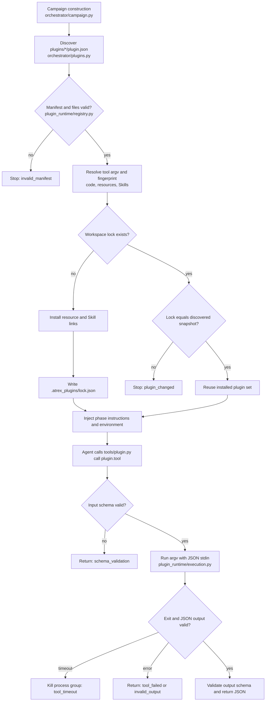

# AKA local plugins

AKA discovers plugins automatically from immediate subdirectories of `plugins/` that contain a
`plugin.json`. Two ship by default and are therefore available to every campaign without another
command-line option: `plugins/gpu-wiki` (scoped optimization experience and hardware facts) and
`plugins/precision-validation` (the production precision policy, backed by the vendored
`3rdparty/atrex-bench` evaluator). A plugin may contribute tools, Skills, instructions, and
workspace resources.

Not every tool is meant for the agent. `precision-validation` is driven by the supervisor, because it
is an acceptance gate on the agent's own output; its instructions therefore describe what the gate
checks rather than how to invoke it. `PluginRegistry.call` is a plain public method, so any
supervisor-side component may use a plugin as a policy seam.

There is no private-tool concept: `instructions()` advertises every tool of every discovered plugin,
so a supervisor-owned tool is still listed for the agent. That is only safe for a tool that is a pure
function of its arguments, as these three are — the supervisor acts solely on results it obtained by
calling them with its own trusted inputs. A supervisor-side policy tool that mutated state, or whose
result the supervisor would read from anywhere the agent can write, would need a different design.

## Two plugin roots

There are two kinds of plugin, and they live in separate directories on purpose.

| Root | Kind | Contract | Contributes |
| --- | --- | --- | --- |
| `plugins/<id>/` | **external** | `plugin.json` manifest; each tool is an argv command exchanging JSON over stdin and stdout, in its own process | Agent-facing tools, Skills, phase instructions, workspace resources |
| `aka/plugins/<id>/` | **in-process** | the Python package module itself carries the declaration (`name`, `apply`, and optionally `Config`/`Defaults`/`inject`/`provide`); a composition row names the module | Capability services and event listeners inside the orchestrator |

This document describes the external contract, which is unchanged. In-process plugins are what a
campaign is *composed of*: `aka/profiles/` lists the rows, `--dump-config` prints the resulting
tree, and `--patch` overrides a row.

The roots are deliberately disjoint. A campaign workspace pins its external plugin set in
`.atrex_plugins/lock.json`, and `check_lock` compares that file byte-for-byte against a freshly
discovered snapshot; adding a directory under `plugins/` would therefore make every existing
workspace unresumable. In-process plugins are never discovered by globbing — the composition names
their modules — and they record themselves in the sibling file `.atrex_plugins/composition.json`.

## Design and runtime flow



The registry is cached for the lifetime of a campaign. Constructing it performs discovery and
fingerprinting once; later prompt rendering, workspace linking, environment creation, and tool
lookup reuse that snapshot. Resume checks compare the saved lock directly with the cached snapshot.

Tools use a command argument array and exchange JSON through stdin and stdout. Python, Node, shell
scripts, and compiled executables share this interface. Arguments are passed without shell
expansion. Each invocation has a bounded timeout and runs in its own process group so a timeout can
clean up descendants.

Skills keep their native directory structure. AKA links each discovered Skill into
`.claude/skills`, `.qoder/skills`, and `.agents/skills`; the selected Agent reads its `SKILL.md` in
the usual way. Conflicting resource or Skill installation paths fail before anything is changed.

## Discover and call tools

From the repository or an initialized campaign workspace:

```bash
python3 tools/plugin.py list
```

The command returns separate `tools` and `skills` catalogs. Each tool uses a namespaced name such as
`gpu-wiki.query`; each Skill has a namespaced catalog ID while retaining its native installation
name.

To query GPU Wiki, create `wiki_request.json`:

```json
{
  "request": "Target hardware B200, DSL triton. Optimize operator rmsnorm and retrieve techniques and pitfalls.",
  "max_records": 6
}
```

Then call:

```bash
python3 tools/plugin.py call gpu-wiki.query --input wiki_request.json
```

`--input -` reads JSON from stdin. The response preserves the Wiki envelope: `query_id`, `records`,
and `notes`. Canonical `wiki_id` values, payloads, and public/internal store isolation are unchanged.
`max_bytes` and `exclude` are also supported input fields.

The standard episode request uses the deterministic Wiki parser. Other prose can invoke the Wiki's
existing bridge agent. Mining and admission through `wiki-gate` remain separate from this query
tool, and direct Wiki scripts remain available for maintenance and standalone use.

The plugin declares the public store and optional `internal_gpu_wiki` sibling as dependencies. A
conflicting `ATREX_WIKI_STORE_ROOT` is rejected instead of silently selecting an undeclared store.

## Add a tool plugin

Add a directory directly under `plugins/`:

```text
plugins/local-docs/
├── plugin.json
├── instructions.md
├── query.py
├── input.json
├── output.json
└── data/
```

`plugin.json`:

```json
{
  "id": "local-docs",
  "version": "1.0.0",
  "api_version": 1,
  "tools": {
    "query": {
      "description": "Retrieve local reference facts.",
      "command": ["{python}", "{plugin_root}/query.py"],
      "input_schema": "input.json",
      "output_schema": "output.json",
      "timeout_seconds": 30
    }
  },
  "instructions": {"common": "instructions.md"},
  "resources": {"local-docs-data": "data"}
}
```

`input.json`:

```json
{
  "type": "object",
  "required": ["request"],
  "additionalProperties": false,
  "properties": {"request": {"type": "string", "minLength": 1}}
}
```

`output.json` can start as `{"type": "object"}`. A minimal implementation is:

```python
import json
import os
import sys
from pathlib import Path

request = json.load(sys.stdin)
root = Path(os.environ["PLUGIN_ROOT"])
text = (root / "data" / "reference.txt").read_text()
print(json.dumps({"source": "reference.txt", "text": text}))
```

Populate `data/reference.txt` and describe when to use the tool in `instructions.md`. The next
campaign discovers it automatically; no orchestrator registration or startup argument is needed.

## Add a Skill-only plugin

```json
{
  "id": "document-review",
  "version": "1.0.0",
  "api_version": 1,
  "skills": {
    "review-document": {
      "path": "skills/review-document",
      "description": "Review a document for clarity and consistency."
    }
  }
}
```

Place the original `SKILL.md` and supporting files in that directory. A Skill-only package needs no
dummy tool or schema. Skills are required by default; `optional: true` permits an absent Skill.
Conflicting native names fail explicitly instead of shadowing another Skill.

## Manifest contract

- Plugin IDs and tool names use lowercase letters, digits, and hyphens, starting with a letter. The
  published tool name is `<plugin-id>.<tool-name>`. Duplicate IDs fail during discovery.
- `api_version` is the integer `1`; `version` identifies the plugin release.
- Each tool declares a description, `command` argv array, input/output schema files, and an integer
  timeout from 1 to 3600 seconds. `command` supports `{python}` and `{plugin_root}` placeholders.
  The executable must exist when the plugin is discovered.
- `instructions` maps scope names to files. `common` is included in every scope. AKA supplies
  `setup`, `episode`, `fast_episode`, and `framework_baseline`, with template values such as
  `{{PLATFORM}}`, `{{ARCH}}`, `{{FRAMEWORK}}`, and `{{OPERATOR}}`.
- `resources` maps workspace names to local paths. A resource can be declared as
  `{"path": "../optional-data", "optional": true, "mount": false}`. Missing optional paths are
  permitted; `mount: false` fingerprints the dependency without exposing a workspace link.
- `skills` maps native names to a directory and description. The directory must contain `SKILL.md`
  unless the Skill is optional.
- `environment` contributes variables to Agent sessions. Values may contain `{workspace}` and
  `{campaign_name}`. Conflicting declarations and reserved runtime variables fail at discovery.

The supported schema subset contains `type`, `description`, `properties`, `required`,
`additionalProperties`, `items`, `enum`, `minLength`, `minimum`, and `maximum`. Types are mandatory;
arrays require an item schema. Unknown keywords and constraints on incompatible types fail at
discovery.

## Locking and recovery

Initialization writes `.atrex_plugins/lock.json` with the discovered plugin directory, resolved
commands, versions, and SHA-256 fingerprints of plugin code, schemas, instructions, resources, and
Skills. Git metadata and Python caches are excluded. Resume and tool invocation fail if this snapshot
no longer matches. Restore the original plugin contents or start a new campaign.

Adding `plugins/precision-validation` changed that snapshot, so workspaces created before it cannot
resume: `check_lock` reports `plugin_changed`, and in production mode the precision gate fails closed
rather than promoting without it. Finish those campaigns on the revision that created them, or start a
fresh workspace. Bumping the `3rdparty/atrex-bench` submodule has the same effect, because the
plugin's declared resources are fingerprinted.

Existing campaigns created before this plugin mechanism should continue with the revision that
created them. To roll back a new campaign, stop it, check out the previous AKA revision, and create a
fresh workspace; campaign workspaces are isolated and the plugin installer does not mutate source
data. The lock detects changes but does not snapshot or sandbox plugin files.

Successful calls return validated JSON directly. Errors use
`{"error":{"code":"tool_failed","message":"..."}}` with a nonzero exit code. Installed campaigns
record tool name, plugin version, status, and duration under `.atrex_plugins/calls/`; request and
response bodies are not logged.
